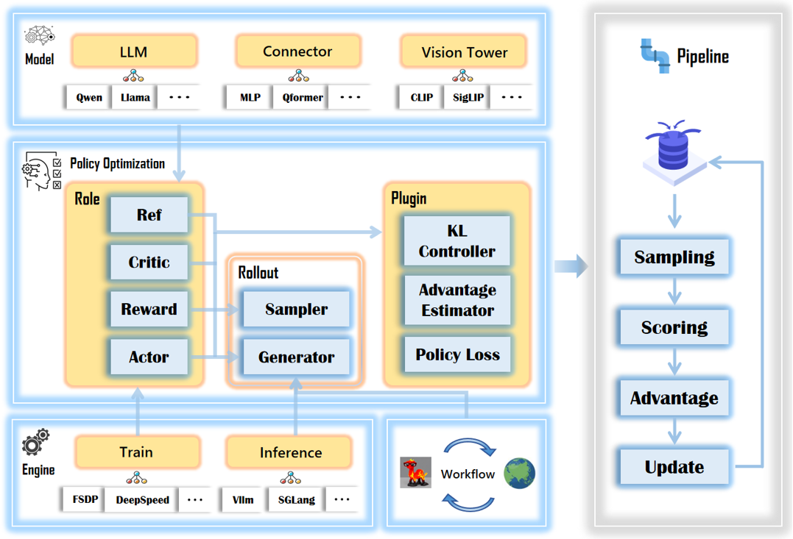

<div align="center">
  
</div>

# RLLaVA: An RL-central Framework for Language and Vision Assistant 🚀

RLLaVA is a user-friendly framework for multi-modal RL. It features an **RL-central** design that decouples algorithm logic from distributed execution, enables modular customization of algorithms, models, and engines, and is optimized for resource-constrained setups to make advanced RL research more accessible.

<div align="center">
  
</div>

---

## ✨ Why RLLaVA?

- **🎯 RL-Centric**: Implements an algorithm-driven approach tailored for RL, decoupling logic from distributed execution so researchers can focus on innovation without distributed system complexities.
- **📦 Modular Design**: Develop, extend, and customize RL algorithms and multi-modal architectures as easily as snapping together building blocks.
- **⚡ Resource-Efficient**: Optimized for resource-constrained teams—most tasks run on a single 24GB GPU, making multi-modal RL truly accessible.
- **🛠️ User-Friendly**: Minimalist code with familiar HuggingFace & PyTorch APIs for seamless setup and extensions.


## 🚀 Quick Start

### 1. Installation

```bash
git clone https://github.com/TinyLoopX/RLLaVA && cd RLLaVA

conda create -n rllava python==3.11 && conda activate rllava

bash ./install.sh
```

### 2. Run Examples

We provide ready-to-run scripts for various algorithms and tasks in the `examples/` directory.

```bash
# Example: Train with GRPO
bash examples/algorithms/qwen2_5_vl_3b_geoqa3k_grpo.sh
```

You can explore more examples in the directory structure:

```bash
examples/
├── algorithms/      # Algorithm comparisons and ablations (GRPO, RLOO, DAPO, etc.)
└── tasks/           # End-to-end task scripts:
    ├── math/        # Geometry, reasoning, and equation solving
    ├── counting/    # Object counting and compositional queries
    ├── grounding/   # Visual grounding and detection-style tasks
    ├── agent_search/# Web search–augmented agents
    ├── agent_code/  # Code-generation agents with tool use
    └── ...          # More real-world multi-modal benchmarks
```

### 3. Customize Your Experiment

RLLaVA makes it easy to define custom tasks. You only need 3 files:

1. **Reward function** → `examples/reward_function/your_task.py`
2. **Prompt template** → `examples/format_prompt/your_task.jinja`  
3. **Launch script / command** → Point to dataset + reward + prompt (no need to modify YAML directly):

```bash
torchrun -m rllava.train.pipeline.rlvr \
  config=examples/config.yaml \
  data.train_files=your_org/dataset@train \
  data.format_prompt=./examples/format_prompt/your_task.jinja \
  reward.reward_function=./examples/reward_function/your_task.py:compute_score \
  algorithm.adv_estimator=grpo  # Switch algorithms here (rloo, remax, ppo, etc.)
```

## 📦 Supported Scope

### Algorithms
We support a broad family of RL methods, enabled by simple config switches:
- GRPO, RLOO, REINFORCE++, OPO, REMAX, GPG, PPO, DAPO, GMPO, GSPO, DR-GRPO, CLIP-COV, KL-COV

**Models:**
- Qwen2-VL and Qwen2.5-VL (2B, 3B, 7B variants) for vision-language tasks
- TinyLLaVA-style architectures with customizable vision encoders, connectors, and LLMs
- Support for LLMs (e.g., Qwen3, LLaMA) in text-only RL scenarios

**Backends:**
- **Training**: FSDP, FSDP2
- **Inference**: vLLM, HuggingFace


## 🤝 Contributing & Community

We welcome contributions! We're especially interested in new RL algorithms, multi-modal tasks, and resource-constrained improvements. Have questions? Join our WeChat group:

<div align="center">
  
</div>

## 🙏 Acknowledgements
Our RL algorithms and distributed training implementation draw inspiration from the open-source community, particularly [veRL](https://github.com/volcengine/verl), [EasyR1](https://github.com/hiyouga/EasyR1), and [AReaL](https://github.com/inclusionAI/AReaL).

## Citation

```bibtex
@misc{zhao2025rllava,
  title        = {RLLaVA: An RL-central Framework for Language and Vision Assistant},
  author       = {Lei Zhao, Zihao Ma, Boyu Lin, Yuhe Liu, Wenjun Wu, Lei Huang},
  howpublished = {\url{https://github.com/TinyLoopX/RLLaVA}},
  year         = {2025}
}
```
